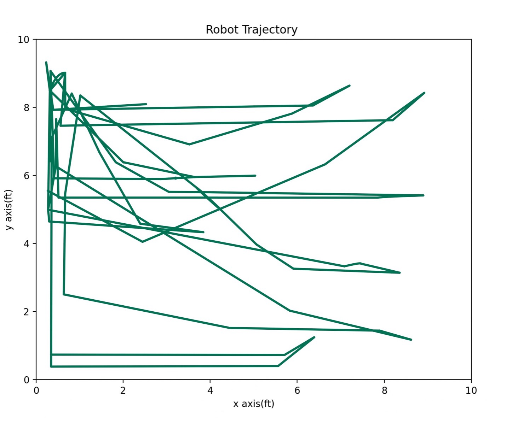

# autonomous_vehicle

In my solo endeavor to build an autonomous vehicle, I've developed a four-wheeled robot outfitted with various sensors such as Ultrasonic, IMU, and wheel encoders. Through the implementation of image processing, obstacle detection, and localization, I've infused the vehicle with autonomy, marking a significant step towards self-navigation

The following shows the trajectory followed by the robot during its run for the competition

### Watch demo
<a href="https://www.example.com](https://youtu.be/nImYLZwmc6c)https://youtu.be/nImYLZwmc6c">Click here</a>
